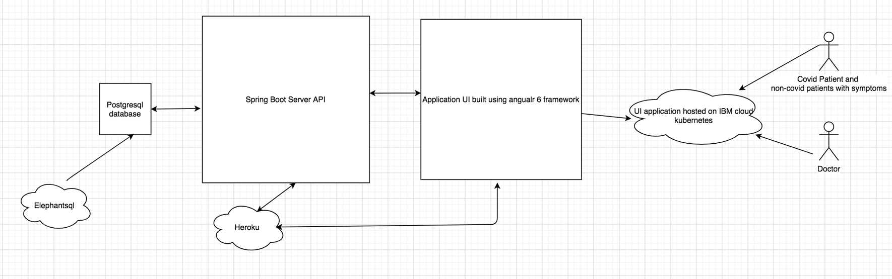
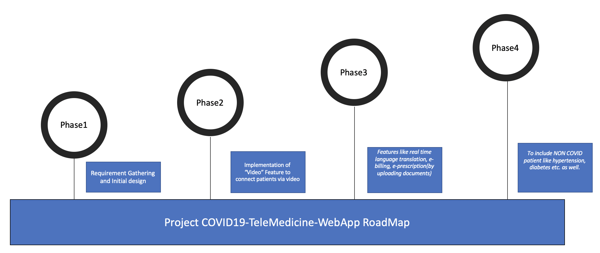

<h1>Submission Name</h1> 
COVID19-TeleMedicine-Web-App

<h2>Contents</h2>
<h2>Short Description</h2> 
The solution will limit the influx of COVID-19  “Low-Risk" patients into the hospitals and provide remote care by this interactive WebApp.
The solution will also track “live status” of the patient.

<h2>Long Description</h2>
<h3>Problem</h3>

Today, the mankind is witnessing unprecedented crisis, in the form of <b>CO</b>rona <b>VI</b>rus <b>D</b>isease -20<b>19</b>. This exponentially growing pandemic has overwhelmed even the best of the healthcare systems worldwide. The rapid incidence in COVID-19 positive cases has resulted in mammoth strain on the healthcare resources - Manpower, Money, Infrastructure and equipment. The need of the hour is effective utilization, prioritization and management of the available resources, so that the most critical and needy could be served and saved.

<h3>Role of Technology</h3>

The "COVID19-TeleMedicine-Web-App" aims to provide healthcare stakeholders with this solution - "To limit the influx of COVID-19 "Asymptomatic" and "Low-Risk" patients into the hospitals, so that only "High-Risk" and “Critical” patients are directed for hospital admits and "in-patient" treatments and ensuring remote “care management” of such low risk patients".

<h3>Idea</h3>

Through this interactive WebApp, the healthcare managers can identify the patients who are in "incubation period" i.e. who are in duration from symptom onset to needing the hospitalization, instruct/guide them for home quarantine and provide both primary and specialty care via “Telemedicine”, thereby ensuring delivery of safe and quality care from remote, while stopping onward transmission and prioritizing the scarce healthcare resources.
The intent of this application is to provide a virtual "conduit" system between the healthcare professionals/ analysts/ primary care physicians and the "home quarantined" COVID-19 patients. This Telemedicine application makes use of electronic communications and software to provide clinical services to COVID19 patients without having to make in-person visits. The system caters for remotely collating patient information/ data, including - subjective observations, symptoms, health assessments, diagnosis, medication management and patient demographics.

<h2>Demo Video</h2>

<h2>Architecture<h2>

<h2>Solution Roadmap</h2> 

<h2>List of one or more IBM Cloud Services or IBM Systems used in the solution</h2>
IBM cloud Kubernetes to deploy the angular application and spring boot code, though we have used Heroku deployment URLS in the angular UI as external IP of IBM Kubernetes is not exposed public for free trial accounts.

<h2>Authors <h4>Team Hack O' Holics</h4></h2>
<table style="width:100%">
  <tr>
    <th>Name</th>
    <th>Email Id</th>
  </tr>
  <tr>
    <td>Charu Saxena</td>
    <td>charu_10@optum.com</td>
   </tr>
  <tr>
    <td>Lakshmi Bijjala</td>
    <td>bijjala.lakshmi@optum.com</td>
  </tr>
    <tr>
    <td>Pooja Panwar</td>
    <td>pooja_panwar@optum.com</td>
  </tr>
    <tr>
    <td>Shraddha Gendle</td>
    <td>shraddha.gendle@optum.com</td>
  </tr>
    <tr>
    <td>Srirupa Bose</td>
    <td>srirupa.bose@optum.com</td>
  </tr>
</table>

